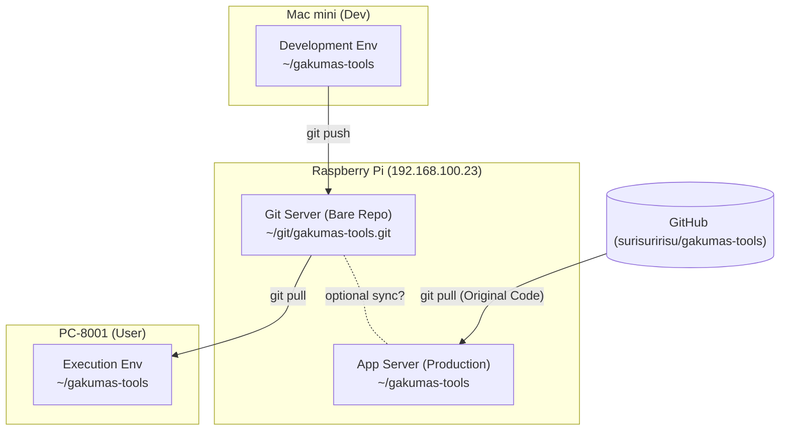

# システム構成図 (System Architecture)

本プロジェクト (`gakumas-tools`) の運用環境・開発環境のネットワーク構成図です。

## 構成概要

宅内LANにおいて、Raspberry Pi を中心とした「開発」「運用」「データ管理」の3役を分担しています。

## 各マシンの役割

### 1. Mac mini (開発機)
*   **役割**: `local-scripts` や `local-run` の開発、および高負荷なシミュレーション実行。
*   **Git運用**: 
    *   コード修正後、Raspberry Pi 上の Git Server へ `push` します。
    *   開発のメインストリームです。

### 2. Raspberry Pi (サーバー機)
1台で2つの異なる役割を担っています。

#### A. Git Server (データ倉庫)
*   **場所**: `~/git/gakumas-tools.git` (Bare Repository)
*   **役割**: 宅内における `gakumas-tools` (カスタム版) の中央リポジトリ。
*   **特徴**: ここでコードは実行しません。あくまで Mac からの変更を受け取り、PC-8001 へ渡すための中継地点です。

#### B. App Server (本家アプリ稼働)
*   **場所**: `~/gakumas-tools`
*   **役割**: GitHub の本家 (`surisuririsu/gakumas-tools`) コードをクローンして稼働させています。
*   **同期**: 基本的に本家 GitHub と同期します（カスタマイズ版 local-scripts とは独立して運用）。

### 3. PC-8001 / ChromeOS Flex (実行機)
*   **役割**: リビング等での軽量なスクリプト実行 (`stats` コマンド等) や、計算結果の閲覧。
*   **Git運用**: Raspberry Pi の Git Server から `pull` して、Mac mini で開発された最新機能を享受します。

## 同期フロー (Workflow)

1.  **Mac mini** で機能を開発・修正。
2.  **Mac mini** から `git push origin master` (送信先は Pi Git)。
3.  **PC-8001** で `git pull` し、最新機能を利用開始。
